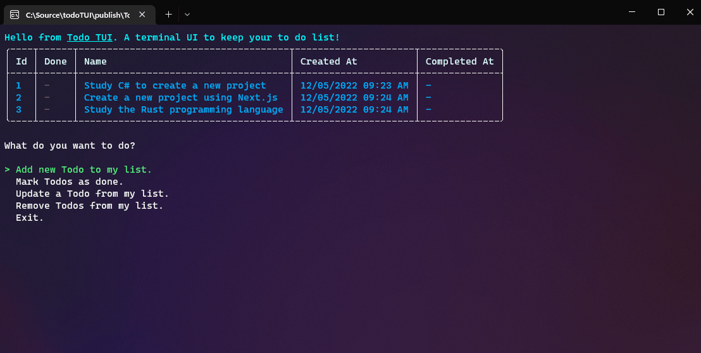

# Todo TUI

This is a console-based to-do list! It uses the amazing [Spectre.Console library](https://spectreconsole.net/) do deal with all the rendering in the terminal.

## Getting Started

- Download the [latest release](https://github.com/LucasRufo/todoTUI/releases) on github.
- Put the executable on the PATH environment variable of your system. By now, the binary only works on Windows.
- Just run `todotui` in your terminal and you are ready to go. 🎉

## Options

You can **Add, Mark as Done, Update and Remove** to-dos based on what you need.

## Tech Stack

This project was made using C#, .NET 6.0, and the [Spectre.Console library](https://spectreconsole.net/).

## License

[MIT License](https://lucasrufo.mit-license.org/) © Lucas Rufo